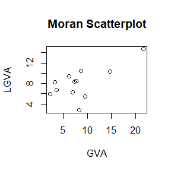
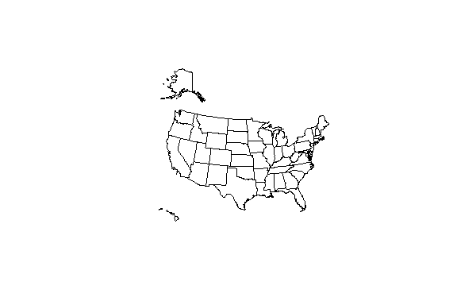

Exercises: 02 Some Important Spatial Definitions
================
Takuya Shimamura
2020-06-12

  - [Exercise 2.1](#exercise-2.1)
      - [1) Unweighted W matrix](#unweighted-w-matrix)
      - [2) Weighted W matrix](#weighted-w-matrix)
  - [Exercise 2.2](#exercise-2.2)
      - [1) Read data](#read-data)
      - [2) Spatially lagged variable](#spatially-lagged-variable)
  - [Exercise 2.3](#exercise-2.3)
      - [1) Create data `W` and `X`](#create-data-w-and-x)
  - [Exercise 2.4](#exercise-2.4)
      - [1) Read GAL file](#read-gal-file)
  - [Exercise 2.5](#exercise-2.5)
      - [1) Read data](#read-data-1)
      - [2) Define `GVA` (Gross Value Added) and
        `W`](#define-gva-gross-value-added-and-w)
      - [3)](#section)
  - [Exercise 2.6](#exercise-2.6)
  - [Exercise 2.7](#exercise-2.7)
      - [1) Define variables](#define-variables)
      - [2) BP test: homoscedasticity](#bp-test-homoscedasticity)
      - [3) JB test: normality of the
        residuals](#jb-test-normality-of-the-residuals)
      - [4) Moran I test: null of uncorrelation among regression
        residuals](#moran-i-test-null-of-uncorrelation-among-regression-residuals)
  - [Exercise 2.8](#exercise-2.8)
      - [1) Read data](#read-data-2)
      - [2) Example 2.3](#example-2.3)
      - [2) Example 2.4](#example-2.4)
  - [Exercise 2.9](#exercise-2.9)
      - [1) Download shapefiles](#download-shapefiles)
      - [2) Read shapefiles](#read-shapefiles)

## Exercise 2.1

#### 1\) Unweighted W matrix

``` r
Wnb_Romania = matrix(
  c(0, 1, 1, 0, 0, 0, 0, 1,
    1, 0, 1, 1, 1, 0, 1, 1,
    1, 1, 0, 1, 0, 0, 0, 0,
    0, 1, 1, 0, 1, 0, 0, 0,
    0, 1, 0, 1, 0, 1, 1, 0,
    0, 0, 0, 0, 1, 0, 0, 0,
    0, 1, 0, 0, 1, 0, 0, 1,
    1, 1, 0, 0, 0, 0, 1, 0),
  nrow = 8,
  ncol = 8)
Wnb_Romania
```

    ##      [,1] [,2] [,3] [,4] [,5] [,6] [,7] [,8]
    ## [1,]    0    1    1    0    0    0    0    1
    ## [2,]    1    0    1    1    1    0    1    1
    ## [3,]    1    1    0    1    0    0    0    0
    ## [4,]    0    1    1    0    1    0    0    0
    ## [5,]    0    1    0    1    0    1    1    0
    ## [6,]    0    0    0    0    1    0    0    0
    ## [7,]    0    1    0    0    1    0    0    1
    ## [8,]    1    1    0    0    0    0    1    0

#### 2\) Weighted W matrix

``` r
Wnb_weight = matrix(
  c(Wrow1 = sum(Wnb_Romania[1, ]),
    Wrow2 = sum(Wnb_Romania[2, ]),
    Wrow3 = sum(Wnb_Romania[3, ]),
    Wrow4 = sum(Wnb_Romania[4, ]),
    Wrow5 = sum(Wnb_Romania[5, ]),
    Wrow6 = sum(Wnb_Romania[6, ]),
    Wrow7 = sum(Wnb_Romania[7, ]),  
    Wrow8 = sum(Wnb_Romania[8, ])),
  nrow = 8,
  ncol = 1)

W_Romania = matrix(
  c(Wnb_Romania[1,] / Wnb_weight[1,],
    Wnb_Romania[2,] / Wnb_weight[2,],
    Wnb_Romania[3,] / Wnb_weight[3,],
    Wnb_Romania[4,] / Wnb_weight[4,],
    Wnb_Romania[5,] / Wnb_weight[5,],
    Wnb_Romania[6,] / Wnb_weight[6,],
    Wnb_Romania[7,] / Wnb_weight[7,],
    Wnb_Romania[8,] / Wnb_weight[8,]),
  nrow = 8,
  byrow = TRUE)
W_Romania
```

    ##           [,1]      [,2]      [,3]      [,4]      [,5] [,6]      [,7]
    ## [1,] 0.0000000 0.3333333 0.3333333 0.0000000 0.0000000 0.00 0.0000000
    ## [2,] 0.1666667 0.0000000 0.1666667 0.1666667 0.1666667 0.00 0.1666667
    ## [3,] 0.3333333 0.3333333 0.0000000 0.3333333 0.0000000 0.00 0.0000000
    ## [4,] 0.0000000 0.3333333 0.3333333 0.0000000 0.3333333 0.00 0.0000000
    ## [5,] 0.0000000 0.2500000 0.0000000 0.2500000 0.0000000 0.25 0.2500000
    ## [6,] 0.0000000 0.0000000 0.0000000 0.0000000 1.0000000 0.00 0.0000000
    ## [7,] 0.0000000 0.3333333 0.0000000 0.0000000 0.3333333 0.00 0.0000000
    ## [8,] 0.3333333 0.3333333 0.0000000 0.0000000 0.0000000 0.00 0.3333333
    ##           [,8]
    ## [1,] 0.3333333
    ## [2,] 0.1666667
    ## [3,] 0.0000000
    ## [4,] 0.0000000
    ## [5,] 0.0000000
    ## [6,] 0.0000000
    ## [7,] 0.3333333
    ## [8,] 0.0000000

## Exercise 2.2

#### 1\) Read data

``` r
library(readxl)
Romania = read_excel("Input/Romania.xlsx")
Romania
```

    ## # A tibble: 8 x 2
    ##   Regions `Infant Mortality Rates (2011)`
    ##   <chr>                             <dbl>
    ## 1 RO11                                8.7
    ## 2 RO12                               10.1
    ## 3 RO21                               10.1
    ## 4 RO22                               11.3
    ## 5 RO31                               10.3
    ## 6 RO32                                5.7
    ## 7 RO41                                9.3
    ## 8 RO42                                8.9

#### 2\) Spatially lagged variable

``` r
IMR = Romania$`Infant Mortality Rates (2011)`
WX = W_Romania %*% IMR
WX
```

    ##           [,1]
    ## [1,]  9.700000
    ## [2,]  9.766667
    ## [3,] 10.033333
    ## [4,] 10.166667
    ## [5,]  9.100000
    ## [6,] 10.300000
    ## [7,]  9.766667
    ## [8,]  9.366667

## Exercise 2.3

#### 1\) Create data `W` and `X`

``` r
library(spdep)
Wnb = cell2nb(5, 5, type = "rook")
W = nb2listw(Wnb)

X = c(27, 16, -1, 23, 19,
       36, 21, 32, 33, 26,
       28, 25, 3, 23, 35,
       14, 12, 16, 14, 12,
       4, 15, 29, 31, -1)
```

``` r
WX = lag.listw(W, X) # X is should not be matrix data
WX
```

    ##  [1] 26.00000 15.66667 23.66667 17.00000 24.50000 25.33333 27.25000
    ##  [8] 14.00000 26.00000 29.00000 25.00000 16.00000 24.00000 21.25000
    ## [15] 20.33333 14.66667 17.50000 14.50000 20.50000 16.00000 14.50000
    ## [22] 15.00000 20.66667 14.00000 21.50000

## Exercise 2.4

#### 1\) Read GAL file

``` r
UK_reg = c(1:12)
nbUK = read.gal("Input/GALfile/UK_GAL.GAL", region.id = UK_reg)
```

`GAL file`  
0 12 UK UK\_reg  
1 4  
3 5 8 12  
2 2  
3 4  
3 2  
1 2  
4 3  
2 5 6  
5 5  
1 4 6 7 8  
6 3  
4 5 7  
7 5  
5 6 8 9 11  
8 5  
1 5 7 11 12  
9 2  
7 11  
10 1  
11  
11 5  
7 8 9 10 12  
12 3  
1 8 11

## Exercise 2.5

#### 1\) Read data

``` r
UK = read_xlsx("Input/UK.xlsx", sheet = "UK")
UK
```

    ## # A tibble: 12 x 5
    ##    Country  Region   `GVA (% of UK)` `Labor Productivi~ `Business Birth~
    ##    <chr>    <chr>              <dbl>              <dbl>            <dbl>
    ##  1 Wales    <NA>                 3.6               81.5              9.3
    ##  2 Scotland <NA>                 8.3               96.9             10.9
    ##  3 Norther~ <NA>                 2.3               82.9              6.5
    ##  4 England  North o~             3.2               86.2             11.2
    ##  5 England  North W~             9.5               88.6             11.1
    ##  6 England  Yorkshi~             6.9               84.7             10.5
    ##  7 England  East Mi~             6.2               89.2             10.3
    ##  8 England  West Mi~             7.3               89.1             10.5
    ##  9 England  East An~             8.7               96.8             10.5
    ## 10 England  Greater~            21.6              140.              14.6
    ## 11 England  South E~            14.7              108.              10.8
    ## 12 England  South W~             7.7               89.8              9.6

#### 2\) Define `GVA` (Gross Value Added) and `W`

``` r
GVA = UK$`GVA (% of UK)` # GVA: Gross Value Added
W_UK = nb2listw(nbUK)
```

#### 3\)

``` r
library(spdep)
LGVA = lag.listw(W_UK, GVA) 
LGVA
```

    ##  [1]  6.700000  2.750000  5.950000  8.233333  5.440000  6.300000
    ##  [7]  9.420000  8.340000 10.450000 14.700000 10.300000  8.533333

## Exercise 2.6

``` r
plot(GVA, LGVA, main = "Moran Scatterplot") 
```

<!-- -->

There is a positive correlation between `GVA` and `LGVA` which is its
spatial value). This suggests spatial correlation for this variable.

## Exercise 2.7

#### 1\) Define variables

``` r
GVA = UK$`GVA (% of UK)` # GVA: Gross Value Added
LP = UK$`Labor Productivity (UK = 100)` # LP: Labor Productivity
BBR = UK$`Business Birth Rate (%)` # BBR: Business Birth Rate

reg_GVA = lm(GVA ~ LP + BBR)
summary(reg_GVA)
```

    ## 
    ## Call:
    ## lm(formula = GVA ~ LP + BBR)
    ## 
    ## Residuals:
    ##     Min      1Q  Median      3Q     Max 
    ## -3.1398 -0.9172 -0.4388  1.0958  2.5365 
    ## 
    ## Coefficients:
    ##              Estimate Std. Error t value Pr(>|t|)    
    ## (Intercept) -22.31118    3.38594  -6.589 0.000100 ***
    ## LP            0.27750    0.05346   5.191 0.000571 ***
    ## BBR           0.42239    0.47243   0.894 0.394567    
    ## ---
    ## Signif. codes:  0 '***' 0.001 '**' 0.01 '*' 0.05 '.' 0.1 ' ' 1
    ## 
    ## Residual standard error: 1.791 on 9 degrees of freedom
    ## Multiple R-squared:  0.9072, Adjusted R-squared:  0.8866 
    ## F-statistic: 43.99 on 2 and 9 DF,  p-value: 2.259e-05

#### 2\) BP test: homoscedasticity

``` r
library(lmtest)
bptest(reg_GVA)
```

    ## 
    ##  studentized Breusch-Pagan test
    ## 
    ## data:  reg_GVA
    ## BP = 1.5183, df = 2, p-value = 0.4681

#### 3\) JB test: normality of the residuals

``` r
library(tseries)
jarque.bera.test(reg_GVA$residuals)
```

    ## 
    ##  Jarque Bera Test
    ## 
    ## data:  reg_GVA$residuals
    ## X-squared = 0.091982, df = 2, p-value = 0.9551

#### 4\) Moran I test: null of uncorrelation among regression residuals

`lm.morantest()` and `moran.test` have same Moran’s *I* statistic value,
but different p-value.

``` r
lm.morantest(reg_GVA, listw = W_UK)
```

    ## 
    ##  Global Moran I for regression residuals
    ## 
    ## data:  
    ## model: lm(formula = GVA ~ LP + BBR)
    ## weights: W_UK
    ## 
    ## Moran I statistic standard deviate = -0.038646, p-value =
    ## 0.5154
    ## alternative hypothesis: greater
    ## sample estimates:
    ## Observed Moran I      Expectation         Variance 
    ##      -0.17589503      -0.16886659       0.03307571

``` r
moran.test(reg_GVA$residuals, listw = W_UK)
```

    ## 
    ##  Moran I test under randomisation
    ## 
    ## data:  reg_GVA$residuals  
    ## weights: W_UK    
    ## 
    ## Moran I statistic standard deviate = -0.42885, p-value = 0.666
    ## alternative hypothesis: greater
    ## sample estimates:
    ## Moran I statistic       Expectation          Variance 
    ##       -0.17589503       -0.09090909        0.03927276

## Exercise 2.8

#### 1\) Read data

``` r
Italy = read_xlsx("Input/Italy.xlsx")
UER = Italy$`Umunployment Rate` # UER: Unemployment Rate
GDP = Italy$`Real GDP` # GDP: Real GDP
PI = Italy$`Price Index` # PI: Price Index

ita_regions = c(1:20)
nbItaly = read.gal("Input/GALfile/Italy_GAL.GAL", region.id = ita_regions)
W_Italy = nb2listw(nbItaly)
```

#### 2\) Example 2.3

  - OLS

<!-- end list -->

``` r
reg_23 = lm(UER ~ GDP)
summary(reg_23)
```

    ## 
    ## Call:
    ## lm(formula = UER ~ GDP)
    ## 
    ## Residuals:
    ##     Min      1Q  Median      3Q     Max 
    ## -3.4449 -1.7419 -0.3307  1.4994  6.2162 
    ## 
    ## Coefficients:
    ##             Estimate Std. Error t value Pr(>|t|)    
    ## (Intercept)   10.971      1.283   8.551 9.38e-08 ***
    ## GDP           -3.326      0.835  -3.984 0.000871 ***
    ## ---
    ## Signif. codes:  0 '***' 0.001 '**' 0.01 '*' 0.05 '.' 0.1 ' ' 1
    ## 
    ## Residual standard error: 2.562 on 18 degrees of freedom
    ## Multiple R-squared:  0.4686, Adjusted R-squared:  0.4391 
    ## F-statistic: 15.87 on 1 and 18 DF,  p-value: 0.0008705

  - BP test

<!-- end list -->

``` r
bptest(reg_23)
```

    ## 
    ##  studentized Breusch-Pagan test
    ## 
    ## data:  reg_23
    ## BP = 0.022502, df = 1, p-value = 0.8808

  - JB test

<!-- end list -->

``` r
jarque.bera.test(reg_23$residuals)
```

    ## 
    ##  Jarque Bera Test
    ## 
    ## data:  reg_23$residuals
    ## X-squared = 1.2331, df = 2, p-value = 0.5398

  - Moran I test

<!-- end list -->

``` r
lm.morantest(reg_23, listw = W_Italy)
```

    ## 
    ##  Global Moran I for regression residuals
    ## 
    ## data:  
    ## model: lm(formula = UER ~ GDP)
    ## weights: W_Italy
    ## 
    ## Moran I statistic standard deviate = 2.7925, p-value = 0.002615
    ## alternative hypothesis: greater
    ## sample estimates:
    ## Observed Moran I      Expectation         Variance 
    ##       0.38450614      -0.07200272       0.02672419

#### 2\) Example 2.4

  - OLS

<!-- end list -->

``` r
reg_24 = lm(UER ~ PI)
summary(reg_24)
```

    ## 
    ## Call:
    ## lm(formula = UER ~ PI)
    ## 
    ## Residuals:
    ##     Min      1Q  Median      3Q     Max 
    ## -4.3404 -1.3598  0.0828  1.4406  5.2836 
    ## 
    ## Coefficients:
    ##             Estimate Std. Error t value Pr(>|t|)    
    ## (Intercept)   -9.827      3.720  -2.642 0.016568 *  
    ## PI             8.746      1.984   4.409 0.000338 ***
    ## ---
    ## Signif. codes:  0 '***' 0.001 '**' 0.01 '*' 0.05 '.' 0.1 ' ' 1
    ## 
    ## Residual standard error: 2.437 on 18 degrees of freedom
    ## Multiple R-squared:  0.5193, Adjusted R-squared:  0.4926 
    ## F-statistic: 19.44 on 1 and 18 DF,  p-value: 0.0003383

  - BP test

<!-- end list -->

``` r
bptest(reg_24)
```

    ## 
    ##  studentized Breusch-Pagan test
    ## 
    ## data:  reg_24
    ## BP = 0.25565, df = 1, p-value = 0.6131

  - JB test

<!-- end list -->

``` r
jarque.bera.test(reg_24$residuals)
```

    ## 
    ##  Jarque Bera Test
    ## 
    ## data:  reg_24$residuals
    ## X-squared = 0.012779, df = 2, p-value = 0.9936

  - Moran I test

<!-- end list -->

``` r
lm.morantest(reg_24, listw = W_Italy)
```

    ## 
    ##  Global Moran I for regression residuals
    ## 
    ## data:  
    ## model: lm(formula = UER ~ PI)
    ## weights: W_Italy
    ## 
    ## Moran I statistic standard deviate = 2.0557, p-value = 0.01991
    ## alternative hypothesis: greater
    ## sample estimates:
    ## Observed Moran I      Expectation         Variance 
    ##       0.26108884      -0.07126624       0.02613900

## Exercise 2.9

#### 1\) Download shapefiles

Shapefiles can be obtained from [National Cancer
Institute](https://gis.cancer.gov/tools/seerstat_bridge/fips_vars/#statefips).

#### 2\) Read shapefiles

``` r
library(maptools)
US = readShapePoly("Input/US/US_State", IDvar = "OBJECTID")
```

    ## Warning: readShapePoly is deprecated; use rgdal::readOGR or sf::st_read

``` r
names(US)
```

    ##  [1] "OBJECTID"   "FIPS"       "FIPSNum"    "StateFIPS"  "StateFIPSN"
    ##  [6] "StateName"  "CensusReg"  "CensusDiv"  "XCentroid"  "YCentroid" 
    ## [11] "Notes"

``` r
plot(US)
```

<!-- -->
