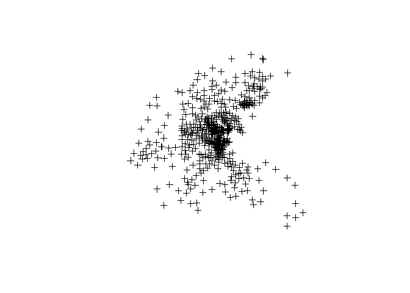

Exercises: 04 Further Topics in Spatial Econometrics
================
Takuya Shimamura
2020-06-09

  - [Packages](#packages)
  - [Exercise 4.1](#exercise-4.1)
  - [Exercise 4.3 Panel data
    (Heteroscedastic)](#exercise-4.3-panel-data-heteroscedastic)
      - [1) Read data](#read-data)
      - [2) Regression](#regression)
  - [Exercise 4.4](#exercise-4.4)
  - [Exercise 4.5 Discrete model](#exercise-4.5-discrete-model)
      - [1) Read data](#read-data-1)
      - [2) Regression](#regression-1)
  - [Exercise 4.6](#exercise-4.6)
  - [Exercise 4.7 Panel data (random
    effect)](#exercise-4.7-panel-data-random-effect)
      - [Read data](#read-data-2)
      - [Regression](#regression-2)
      - [Interpretation](#interpretation)
  - [Exercise 4.8 Non-stationary](#exercise-4.8-non-stationary)
      - [Read data](#read-data-3)
      - [Regression](#regression-3)

## Packages

``` r
library(spdep)     # spatial econometrics
library(sphet)     # heteroscedastic
library(McSpatial) # discrete model
library(splm)      # panel data
library(spgwr)     # non-stationary
library(lmtest)    # test linear regression models
library(tseries)   # time-series (JB test)
library(maptools)  #
```

## Exercise 4.1

theory \#\# Exercise 4.2 theory

## Exercise 4.3 Panel data (Heteroscedastic)

#### 1\) Read data

1)  Read `Prpduc`

<!-- end list -->

``` r
library(readxl)
EU <- read_xlsx("Input/EU.xlsx")
head(EU)
```

    ## # A tibble: 6 x 7
    ##    ...1 `Country Code` Country `% Education Ex~ `Growth 2010–20~
    ##   <dbl> <chr>          <chr>              <dbl>            <dbl>
    ## 1     1 BE             Belgium             42               1.05
    ## 2     2 BG             Bulgar~             27.9             1.06
    ## 3     3 CZ             Czech ~             17.5             1.04
    ## 4     4 DK             Denmark             40.7             1.07
    ## 5     5 DE             Germany             29.4             1.07
    ## 6     6 EE             Estonia             35.9             1.17
    ## # ... with 2 more variables: `% of Hi-tec Exports` <dbl>,
    ## #   `Hi-tec Intensity` <dbl>

2)  Define variables

<!-- end list -->

``` r
growth <- EU$`Growth 2010–2011`
edu <- EU$`% Education Expenses 2009`
```

3)  Read GAL file

<!-- end list -->

``` r
eu_countries <- c(1:27)
nbEU <- read.gal("Input/GALfile/EU_GAL.GAL", region.id = eu_countries)
W_EU <- nb2listw(nbEU)
```

#### 2\) Regression

1)  Pooling model

<!-- end list -->

``` r
library(sphet)
Hetero_SARAR <- gstslshet(growth ~ edu, listw = W_EU)
summary(Hetero_SARAR)
```

    ## 
    ##  Generalized stsls
    ## 
    ## Call:
    ## gstslshet(formula = growth ~ edu, listw = W_EU)
    ## 
    ## Residuals:
    ##      Min.   1st Qu.    Median      Mean   3rd Qu.      Max. 
    ## -0.090765 -0.016785  0.000698  0.000415  0.014464  0.108209 
    ## 
    ## Coefficients:
    ##               Estimate Std. Error t-value Pr(>|t|)
    ## (Intercept)  0.5084726  0.7745943  0.6564   0.5115
    ## edu          0.0011627  0.0009185  1.2658   0.2056
    ## lambda       0.4922055  0.7467230  0.6592   0.5098
    ## rho         -0.4830959  0.6418456 -0.7527   0.4517
    ## 
    ## Wald test that rho and lambda are both zero:
    ##  Statistics: 0.0001582 p-val: 0.98996

## Exercise 4.4

theory

## Exercise 4.5 Discrete model

#### 1\) Read data

1)  Define data

<!-- end list -->

``` r
EU <- read_xlsx("Input/EU.xlsx")
growth <- EU$`Growth 2010–2011`
edu <- EU$`% Education Expenses 2009`
HIE <- EU$`% of Hi-tec Exports`       # % of hi-tec export rate
HTI <- EU$`Hi-tec Intensity`          # hi-tec intensity
```

2)  Denife geographical weight for deicrete model

<!-- end list -->

``` r
eu_countries <- c(1:27)
nbEU <- read.gal("Input/GALfile/EU_GAL.GAL", region.id = eu_countries)
Wdash_EU <- nb2mat(nbEU)
```

#### 2\) Regression

1)  a-spatial probit

<!-- end list -->

``` r
library(McSpatial)
# a-spatial Probit and Logit models
aSpatial_probit <- glm(HTI ~ edu, family = binomial(link="probit"))
summary(aSpatial_probit)
```

    ## 
    ## Call:
    ## glm(formula = HTI ~ edu, family = binomial(link = "probit"))
    ## 
    ## Deviance Residuals: 
    ##     Min       1Q   Median       3Q      Max  
    ## -1.2113  -0.8375  -0.5451   1.0818   2.0927  
    ## 
    ## Coefficients:
    ##             Estimate Std. Error z value Pr(>|z|)  
    ## (Intercept) -2.28401    1.02897  -2.220   0.0264 *
    ## edu          0.05085    0.02805   1.812   0.0699 .
    ## ---
    ## Signif. codes:  0 '***' 0.001 '**' 0.01 '*' 0.05 '.' 0.1 ' ' 1
    ## 
    ## (Dispersion parameter for binomial family taken to be 1)
    ## 
    ##     Null deviance: 32.815  on 26  degrees of freedom
    ## Residual deviance: 29.100  on 25  degrees of freedom
    ## AIC: 33.1
    ## 
    ## Number of Fisher Scoring iterations: 4

2)  Spatial Probit: ML

<!-- end list -->

``` r
Probit_ML <- spprobitml(HTI ~ edu, wmat = Wdash_EU, stdprobit = FALSE)
```

    ## Conditional on rho 
    ## rho =  -0.9899289 
    ##       Estimate Std. Error   z-value    Pr(>|z|)
    ## HTI -7.6160995 2.93966974 -2.590801 0.009575282
    ## edu  0.1418404 0.06095839  2.326839 0.019973838
    ## Unconditional Standard Errors 
    ##       Estimate Std. Error    z-value   Pr(>|z|)
    ## HTI -7.6160995 3.69610584  -2.060574 0.03934370
    ## edu  0.1418404 0.06939718   2.043892 0.04096418
    ## rho -0.9899289 0.07954971 -12.444155 0.00000000
    ## Number of observations =  27

3)  Spatial Probit: GMM

<!-- end list -->

``` r
library(car)
rho0 <- 0  
rho = rho0  # |rho0|<1
Probit_GMM <- gmmprobit(HTI ~ edu, wmat = Wdash_EU, startrho = rho0)
```

    ## STANDARD PROBIT ESTIMATES 
    ## 
    ## Call:
    ## glm(formula = form, family = binomial(link = "probit"), data = data)
    ## 
    ## Deviance Residuals: 
    ##     Min       1Q   Median       3Q      Max  
    ## -1.2113  -0.8375  -0.5451   1.0818   2.0927  
    ## 
    ## Coefficients:
    ##             Estimate Std. Error z value Pr(>|z|)  
    ## (Intercept) -2.28401    1.02897  -2.220   0.0264 *
    ## edu          0.05085    0.02805   1.812   0.0699 .
    ## ---
    ## Signif. codes:  0 '***' 0.001 '**' 0.01 '*' 0.05 '.' 0.1 ' ' 1
    ## 
    ## (Dispersion parameter for binomial family taken to be 1)
    ## 
    ##     Null deviance: 32.815  on 26  degrees of freedom
    ## Residual deviance: 29.100  on 25  degrees of freedom
    ## AIC: 33.1
    ## 
    ## Number of Fisher Scoring iterations: 4
    ## 
    ## [1] 1.000000 1.833414
    ## [1] 2.0000000 0.5914933
    ## [1] 3.000000 0.987086
    ## [1] 4.000000 0.982408
    ## [1] 5.000000 0.710659
    ## [1] 6.00000000 0.06561943
    ## [1] 7.0000000000 0.0004201228
    ## [1] 8.000000e+00 1.445901e-05
    ## SPATIAL GMM PROBIT ESTIMATES 
    ##               Estimate Std. Error   z-value  Pr(>|z|)
    ## (Intercept) -6.2721220 6.09782125 -1.028584 0.3036752
    ## edu          0.1149863 0.07506146  1.531896 0.1255482
    ## WXB         -0.8622952 0.53118732 -1.623335 0.1045177

4)  Spatial Probit: LGMM

<!-- end list -->

``` r
Probit_LGMM <- spprobitml(HTI ~ edu, wmat = Wdash_EU)
```

    ## Standard Probit Estimates 
    ## 
    ## Call:
    ## glm(formula = form, family = binomial(link = "probit"), data = data)
    ## 
    ## Deviance Residuals: 
    ##     Min       1Q   Median       3Q      Max  
    ## -1.2113  -0.8375  -0.5451   1.0818   2.0927  
    ## 
    ## Coefficients:
    ##             Estimate Std. Error z value Pr(>|z|)  
    ## (Intercept) -2.28401    1.02897  -2.220   0.0264 *
    ## edu          0.05085    0.02805   1.812   0.0699 .
    ## ---
    ## Signif. codes:  0 '***' 0.001 '**' 0.01 '*' 0.05 '.' 0.1 ' ' 1
    ## 
    ## (Dispersion parameter for binomial family taken to be 1)
    ## 
    ##     Null deviance: 32.815  on 26  degrees of freedom
    ## Residual deviance: 29.100  on 25  degrees of freedom
    ## AIC: 33.1
    ## 
    ## Number of Fisher Scoring iterations: 4
    ## 
    ## Conditional on rho 
    ## rho =  -0.9899289 
    ##       Estimate Std. Error   z-value    Pr(>|z|)
    ## HTI -7.6160995 2.93966974 -2.590801 0.009575282
    ## edu  0.1418404 0.06095839  2.326839 0.019973838
    ## Unconditional Standard Errors 
    ##       Estimate Std. Error    z-value   Pr(>|z|)
    ## HTI -7.6160995 3.69610584  -2.060574 0.03934370
    ## edu  0.1418404 0.06939718   2.043892 0.04096418
    ## rho -0.9899289 0.07954971 -12.444155 0.00000000
    ## Number of observations =  27

## Exercise 4.6

theory

## Exercise 4.7 Panel data (random effect)

#### Read data

1)  Read *Insurance*

<!-- end list -->

``` r
library(splm)
data("Insurance")
str(Insurance)
```

    ## 'data.frame':    515 obs. of  22 variables:
    ##  $ code     : num  1 1 1 1 1 2 2 2 2 2 ...
    ##  $ year     : num  1998 1999 2000 2001 2002 ...
    ##  $ ppcd     : num  330 338 346 360 391 ...
    ##  $ rgdp     : num  21708 22177 22425 22445 22395 ...
    ##  $ bank     : num  12495 10869 10474 10353 10229 ...
    ##  $ den      : num  325 324 324 317 318 ...
    ##  $ rirs     : num  3.97 2.85 3.42 3.24 2.9 ...
    ##  $ agen     : num  0.486 0.442 0.394 0.397 0.386 ...
    ##  $ school   : num  37.8 40.3 41.8 41.9 42.4 ...
    ##  $ vaagr    : num  0.813 0.859 0.766 0.764 0.71 ...
    ##  $ fam      : num  2.34 2.33 2.31 2.32 2.2 ...
    ##  $ inef     : num  2.53 2.53 2.53 2.53 2.53 ...
    ##  $ trust    : num  3.31 3.31 3.31 3.31 3.31 ...
    ##  $ d99      : num  0 1 0 0 0 0 1 0 0 0 ...
    ##  $ d00      : num  0 0 1 0 0 0 0 1 0 0 ...
    ##  $ d01      : num  0 0 0 1 0 0 0 0 1 0 ...
    ##  $ d02      : num  0 0 0 0 1 0 0 0 0 1 ...
    ##  $ NorthWest: num  1 1 1 1 1 1 1 1 1 1 ...
    ##  $ NorthEast: num  0 0 0 0 0 0 0 0 0 0 ...
    ##  $ Centre   : num  0 0 0 0 0 0 0 0 0 0 ...
    ##  $ South    : num  0 0 0 0 0 0 0 0 0 0 ...
    ##  $ Islands  : num  0 0 0 0 0 0 0 0 0 0 ...

2)  Define geographical weitht

<!-- end list -->

``` r
data("itaww")
W_Italy <- mat2listw(itaww)
```

#### Regression

1)  # SEM-RE (random)

<!-- end list -->

``` r
Random_SEMRE <- spml(ppcd ~ rgdp, data = Insurance, listw = W_Italy, model = "random",
                     spatial.error = "b", lag = FALSE)
summary(Random_SEMRE)
```

    ## ML panel with , random effects, spatial error correlation 
    ## 
    ## Call:
    ## spreml(formula = formula, data = data, index = index, w = listw2mat(listw), 
    ##     w2 = listw2mat(listw2), lag = lag, errors = errors, cl = cl)
    ## 
    ## Residuals:
    ##    Min. 1st Qu.  Median    Mean 3rd Qu.    Max. 
    ## -79.827 -42.865 -11.684   0.002  31.918 258.027 
    ## 
    ## Error variance parameters:
    ##      Estimate Std. Error t-value  Pr(>|t|)    
    ## phi 20.115801   4.233411  4.7517 2.017e-06 ***
    ## rho  0.122710   0.064497  1.9026    0.0571 .  
    ## 
    ## Coefficients:
    ##                Estimate  Std. Error t-value  Pr(>|t|)    
    ## (Intercept) -5.2562e+01  1.4953e+01 -3.5153 0.0004393 ***
    ## rgdp         1.4241e-02  7.9693e-04 17.8700 < 2.2e-16 ***
    ## ---
    ## Signif. codes:  0 '***' 0.001 '**' 0.01 '*' 0.05 '.' 0.1 ' ' 1

2)  KPP (random)

<!-- end list -->

``` r
Random_KPP <- spml(ppcd ~ rgdp, data = Insurance, listw = W_Italy, model = "random",
                   spatial.error = "kkp", lag = FALSE)
summary(Random_KPP)
```

    ## ML panel with , spatial RE (KKP), spatial error correlation 
    ## 
    ## Call:
    ## spreml(formula = formula, data = data, index = index, w = listw2mat(listw), 
    ##     w2 = listw2mat(listw2), lag = lag, errors = errors, cl = cl)
    ## 
    ## Residuals:
    ##    Min. 1st Qu.  Median    Mean 3rd Qu.    Max. 
    ##  -85.46  -55.86  -12.99    1.06   44.87  296.04 
    ## 
    ## Error variance parameters:
    ##      Estimate Std. Error t-value  Pr(>|t|)    
    ## phi 19.643001   3.823318  5.1377 2.781e-07 ***
    ## rho  0.350583   0.061863  5.6671 1.452e-08 ***
    ## 
    ## Coefficients:
    ##              Estimate Std. Error t-value Pr(>|t|)    
    ## (Intercept)  3.597303  18.020311  0.1996   0.8418    
    ## rgdp         0.010979   0.000929 11.8179   <2e-16 ***
    ## ---
    ## Signif. codes:  0 '***' 0.001 '**' 0.01 '*' 0.05 '.' 0.1 ' ' 1

#### Interpretation

1)  Concept of errors for panel data \[
    y_{it} = \alpha + X_{it} \beta + u_{it} = \alpha + X_{it} \beta + (\mu_i + \epsilon_{it}) 
    \]

2)  Definition of residuals in SEM-RE \[
    \epsilon_t = \rho W \epsilon_t + \eta_t
    \]

3)  Definition of residuals in KPP \[
    u = \mu + \epsilon = \rho (I_T*W)u + \eta
    \]

4)  SEM-RE vs KPP SEM-RE considers only \(\epsilon_{it}\)
    (idiosysncratic error component). KKP considers both \(\mu_i\)
    (individual error component) and \(\epsilon_{it}\) (idiosysncratic
    error component).

5)  Summary \(\rho\) is insignificant in REM-RE (\(\rho\) is significant
    in only KPP) -\> idiosysncratic error component is not significant
    -\> only individual error component has spatial auto-correlation

## Exercise 4.8 Non-stationary

#### Read data

1)  Read *boston*

<!-- end list -->

``` r
data(boston)
W_boston <- nb2listw(boston.soi)
```

#### Regression

1)  OLS

<!-- end list -->

``` r
OLS <- lm(MEDV ~ RM, data = boston.c)
summary(OLS)
```

    ## 
    ## Call:
    ## lm(formula = MEDV ~ RM, data = boston.c)
    ## 
    ## Residuals:
    ##     Min      1Q  Median      3Q     Max 
    ## -23.346  -2.547   0.090   2.986  39.433 
    ## 
    ## Coefficients:
    ##             Estimate Std. Error t value Pr(>|t|)    
    ## (Intercept)  -34.671      2.650  -13.08   <2e-16 ***
    ## RM             9.102      0.419   21.72   <2e-16 ***
    ## ---
    ## Signif. codes:  0 '***' 0.001 '**' 0.01 '*' 0.05 '.' 0.1 ' ' 1
    ## 
    ## Residual standard error: 6.616 on 504 degrees of freedom
    ## Multiple R-squared:  0.4835, Adjusted R-squared:  0.4825 
    ## F-statistic: 471.8 on 1 and 504 DF,  p-value: < 2.2e-16

2)  SLM (ML)

<!-- end list -->

``` r
SLM_ML <- lagsarlm(MEDV ~ RM, data = boston.c, listw = W_boston)
summary(SLM_ML)
```

    ## 
    ## Call:
    ## lagsarlm(formula = MEDV ~ RM, data = boston.c, listw = W_boston)
    ## 
    ## Residuals:
    ##       Min        1Q    Median        3Q       Max 
    ## -17.30015  -2.59519  -0.26782   1.99724  30.41134 
    ## 
    ## Type: lag 
    ## Coefficients: (asymptotic standard errors) 
    ##              Estimate Std. Error z value  Pr(>|z|)
    ## (Intercept) -26.15703    1.84346 -14.189 < 2.2e-16
    ## RM            5.40380    0.33322  16.217 < 2.2e-16
    ## 
    ## Rho: 0.65134, LR test value: 343.56, p-value: < 2.22e-16
    ## Asymptotic standard error: 0.026957
    ##     z-value: 24.162, p-value: < 2.22e-16
    ## Wald statistic: 583.82, p-value: < 2.22e-16
    ## 
    ## Log likelihood: -1501.297 for lag model
    ## ML residual variance (sigma squared): 19.327, (sigma: 4.3962)
    ## Number of observations: 506 
    ## Number of parameters estimated: 4 
    ## AIC: 3010.6, (AIC for lm: 3352.2)
    ## LM test for residual autocorrelation
    ## test value: 2.118, p-value: 0.14557

3)  GWR

<!-- end list -->

``` r
library(spgwr)
coords <- coordinates(boston.utm)
bw <- gwr.sel(MEDV ~ RM, data = boston.c, coords, gweight = gwr.Gauss, adapt = TRUE)
```

    ## Adaptive q: 0.381966 CV score: 20166.62 
    ## Adaptive q: 0.618034 CV score: 21233.07 
    ## Adaptive q: 0.236068 CV score: 18825.81 
    ## Adaptive q: 0.145898 CV score: 17191.68 
    ## Adaptive q: 0.09016994 CV score: 15713.41 
    ## Adaptive q: 0.05572809 CV score: 14520.31 
    ## Adaptive q: 0.03444185 CV score: 13177.42 
    ## Adaptive q: 0.02128624 CV score: 11328.31 
    ## Adaptive q: 0.01315562 CV score: 9563.751 
    ## Adaptive q: 0.008130619 CV score: 8243.452 
    ## Adaptive q: 0.005024999 CV score: 7271.725 
    ## Adaptive q: 0.00310562 CV score: 6953.013 
    ## Adaptive q: 0.00122419 CV score: NA 
    ## Adaptive q: 0.003838757 CV score: 6919.131 
    ## Adaptive q: 0.003601323 CV score: 6877.072 
    ## Adaptive q: 0.003523471 CV score: 6872.748 
    ## Adaptive q: 0.003482781 CV score: 6872.581 
    ## Adaptive q: 0.00344209 CV score: 6873.957 
    ## Adaptive q: 0.003482781 CV score: 6872.581

``` r
GWR <- gwr(MEDV ~ RM, data = boston.c, coords, adapt = bw, hatmatrix = TRUE)
GWR
```

    ## Call:
    ## gwr(formula = MEDV ~ RM, data = boston.c, coords = coords, adapt = bw, 
    ##     hatmatrix = TRUE)
    ## Kernel function: gwr.Gauss 
    ## Adaptive quantile: 0.003482781 (about 1 of 506 data points)
    ## Summary of GWR coefficient estimates at data points:
    ##                   Min.   1st Qu.    Median   3rd Qu.      Max.
    ## X.Intercept. -120.5696  -38.3639  -23.1305   -5.0590   52.5392
    ## RM             -5.9743    3.6259    7.4429    9.8380   21.3150
    ##                Global
    ## X.Intercept. -34.6706
    ## RM             9.1021
    ## Number of data points: 506 
    ## Effective number of parameters (residual: 2traceS - traceS'S): 244.1532 
    ## Effective degrees of freedom (residual: 2traceS - traceS'S): 261.8468 
    ## Sigma (residual: 2traceS - traceS'S): 3.178947 
    ## Effective number of parameters (model: traceS): 182.1537 
    ## Effective degrees of freedom (model: traceS): 323.8463 
    ## Sigma (model: traceS): 2.858495 
    ## Sigma (ML): 2.286818 
    ## AICc (GWR p. 61, eq 2.33; p. 96, eq. 4.21): 2848.954 
    ## AIC (GWR p. 96, eq. 4.22): 2455.207 
    ## Residual sum of squares: 2646.146 
    ## Quasi-global R2: 0.938053

``` r
library(readr)
length(GWR)
```

    ## [1] 12

``` r
GWR
```

    ## Call:
    ## gwr(formula = MEDV ~ RM, data = boston.c, coords = coords, adapt = bw, 
    ##     hatmatrix = TRUE)
    ## Kernel function: gwr.Gauss 
    ## Adaptive quantile: 0.003482781 (about 1 of 506 data points)
    ## Summary of GWR coefficient estimates at data points:
    ##                   Min.   1st Qu.    Median   3rd Qu.      Max.
    ## X.Intercept. -120.5696  -38.3639  -23.1305   -5.0590   52.5392
    ## RM             -5.9743    3.6259    7.4429    9.8380   21.3150
    ##                Global
    ## X.Intercept. -34.6706
    ## RM             9.1021
    ## Number of data points: 506 
    ## Effective number of parameters (residual: 2traceS - traceS'S): 244.1532 
    ## Effective degrees of freedom (residual: 2traceS - traceS'S): 261.8468 
    ## Sigma (residual: 2traceS - traceS'S): 3.178947 
    ## Effective number of parameters (model: traceS): 182.1537 
    ## Effective degrees of freedom (model: traceS): 323.8463 
    ## Sigma (model: traceS): 2.858495 
    ## Sigma (ML): 2.286818 
    ## AICc (GWR p. 61, eq 2.33; p. 96, eq. 4.21): 2848.954 
    ## AIC (GWR p. 96, eq. 4.22): 2455.207 
    ## Residual sum of squares: 2646.146 
    ## Quasi-global R2: 0.938053

``` r
plot(GWR$SDF)
```

<!-- -->

4)  Moran test (auto correlation) SLM-LM

<!-- end list -->

``` r
moran.test(SLM_ML$residuals, W_boston)
```

    ## 
    ##  Moran I test under randomisation
    ## 
    ## data:  SLM_ML$residuals  
    ## weights: W_boston    
    ## 
    ## Moran I statistic standard deviate = 1.1179, p-value =
    ## 0.1318
    ## alternative hypothesis: greater
    ## sample estimates:
    ## Moran I statistic       Expectation          Variance 
    ##      0.0333275583     -0.0019801980      0.0009976356

GWR

``` r
gwr.morantest(GWR, W_boston)
```

    ## 
    ##  Leung et al. 2000 three moment approximation for Moran's
    ##  I
    ## 
    ## data:  GWR residuals
    ## statistic = 52.219, df = 205.95, p-value < 2.2e-16
    ## sample estimates:
    ##          I 
    ## 0.03685895
